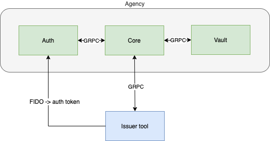

# findy-issuer-tool

[](https://github.com/findy-network/findy-issuer-tool/actions/workflows/test.yml)

## Getting Started

Findy Agency is a collection of services ([Core](https://github.com/findy-network/findy-agent),
[Auth](https://github.com/findy-network/findy-agent-auth),
[Vault](https://github.com/findy-network/findy-agent-vault) and
[Web Wallet](https://github.com/findy-network/findy-wallet-pwa)) that provide
full SSI agency along with a web wallet for individuals.
To start experimenting with Findy Agency we recommend you to start with
[the documentation](https://findy-network.github.io/) and
[set up the agency to your localhost environment](https://github.com/findy-network/findy-wallet-pwa/tree/dev/tools/env#agency-setup-for-local-development).

- [Documentation](https://findy-network.github.io/)
- [Instructions for starting agency in Docker containers](https://github.com/findy-network/findy-wallet-pwa/tree/dev/tools/env#agency-setup-for-local-development)

## Project

Utility (UI) Node.js tool and sample project for issuing and verifying with Findy agency.

The tool works as a helper UI for

- create schemas and credential definitions to ledger
- test different Aries protocols (connecting, issuing, verifying, message sending) through Findy agency.

The project demonstrates how to implement JS-based issuer/verifier application with Findy agency. Check details [in the source code](./api/src/agent/index.js). In addition to the protocol starters, the agent module has functionality for listening the cloud agent. That means the app gets notified of all the cloud agent events. It also shows how to handle the verification requests through the agency question/answer interface.

This project's main purpose is to work as example code for JS applications and ease the playing around with verified data for non-technical folks. If you need an agent manipulation tool with more extensive feature set, please install [findy-agent-cli](https://github.com/findy-network/findy-agent-cli).

## Environment overview



App authenticates to [agency](https://github.com/findy-network/findy-agent) using [authentication service](https://github.com/findy-network/findy-agent-auth). Protocols and agent data is handled through [agency's GRPC API](https://github.com/findy-network/findy-agent-api). API handlers and authentication are implemented using [findy-common-ts helper library](https://github.com/findy-network/findy-common-ts).

[Findy web wallet](https://github.com/findy-network/findy-wallet-pwa) can be used as the other agent when testing the pairwise capabilities.

## Setup environment

1. This app utilises Findy agency for issuing and verifying credentials. You can either connect to a cloud installation of Findy agency or [launch agency locally](https://github.com/findy-network/findy-wallet-pwa/blob/master/tools/env/README.md).

1. **Start backend server**

   1. [Setup](https://docs.github.com/en/packages/working-with-a-github-packages-registry/working-with-the-npm-registry#authenticating-with-a-personal-access-token) GitHub package registry authentication

   1. Install dependencies

      ```sh
      cd api
      echo "@findy-network:registry=https://npm.pkg.github.com" >> .npmrc
      npm install
      ```

   1. Declare agency configuration using environment variables or configuration file (check ./config/default.json).

      Following settings are mandatory for successful agency connection:

      ```sh
      export ISSUER_TOOL_AGENCY_AUTH_URL=<agency auth service URL e.g. https://agency.example.com>
      export ISSUER_TOOL_AGENCY_AUTH_ORIGIN=<agency auth service URL e.g. https://agency.example.com>
      export ISSUER_TOOL_AGENCY_USER_NAME=<unique agent name e.g. local-issuer-tool>
      export ISSUER_TOOL_AGENCY_KEY=<authenticator key e.g. 15308490f1e4026284594dd08d31291bc8ef2aeac730d0daf6ff87bb92d4336c>
      export ISSUER_TOOL_SERVER_ADDRESS=<agency core service address e.g. agency-api.example.com>
      export ISSUER_TOOL_SERVER_PORT=<agency core service port e.g. 50051>
      export ISSUER_TOOL_SERVER_CERT_PATH=<path containing the grpc API cert in case untrusted issuer e.g. ../tools/local-cert, otherwise empty>
      ```

      [By default](./api/config/default.json), the service tries to connect the local agency:

      ```json
      "agency": {
         "authUrl": "http://localhost:8088",
         "authOrigin": "http://localhost:3000",
         "userName": "my-issuer-tool",
         "key": "15308490f1e4026284594dd08d31291bc8ef2aeac730d0daf6ff87bb92d4336c",
         "serverAddress": "localhost",
         "serverPort": 50052,
         "certPath": "../tools/local-cert",
         "verifyServerIdentity": true
      }
      ```

      Note:

      - the key value is your agency authenticator master key and should be kept secret in production environment.
      - the auth origin is usually needed only in development setup where wallet app and authentication service resides in different domains
      - more info for GRPC errors can be revealed setting following env variables:

        ```shell
        export GRPC_VERBOSITY=debug
        export GRPC_TRACE=all
        ```

   1. Start database service in local container: `npm run db`

   1. Define _dummy_ AWS access keys (needed for local dynamo-db access):

      ```bash
      export AWS_ACCESS_KEY_ID="foo"
      export AWS_SECRET_ACCESS_KEY="bar"
      ```

   1. Run server: `npm start`

1. **Start frontend server**

   1. Open new terminal

   1. Run

      ```sh
      cd frontend
      npm install
      npm start
      ```

## Usage

### Login

1. Open browser at <http://localhost:8081>
1. Login using "Dev login"-button. Optionally you can configure [GitHub login](./api/README.md#github_authentication)

### Create schema and credential definition

1. Create schema

   Define schema name, version and attributes and click "Save".

   

1. Create credential definition

   Define schema id, credential definition tag and click "Save".

   

### Send chat message

1. Make pairwise connection

   Copy invitation json, paste it to wallet and add connection.

   

1. Send message to new connection

   Select connection, type message and click send.

   

### Issue and verify credentials

1. Issue credential

   Select connection and credential definition, define attributes and click send.
   Accept credential in wallet application.

   

1. Verify credential

   Select connection and credential definition, define attributes and click send.
   Accept proof request in wallet application. Proof succeeds if the credential
   values sent from the wallet match the proof attributes you defined when sending
   the request.

   

## Authentication

In development mode you can login using "Dev login"-button.
Optionally you can configure [GitHub login](./api/README.md#github_authentication)
The app also showcases how to login using verified credentials.
For this approach to work, you need to setup and configure
[findy-oidc-provider](https://github.com/findy-network/findy-oidc-provider) installation.
See [the docs](https://github.com/findy-network/findy-issuer-tool/blob/master/api/README.md#ftn-credential-flow)
for acquiring the login credential.
