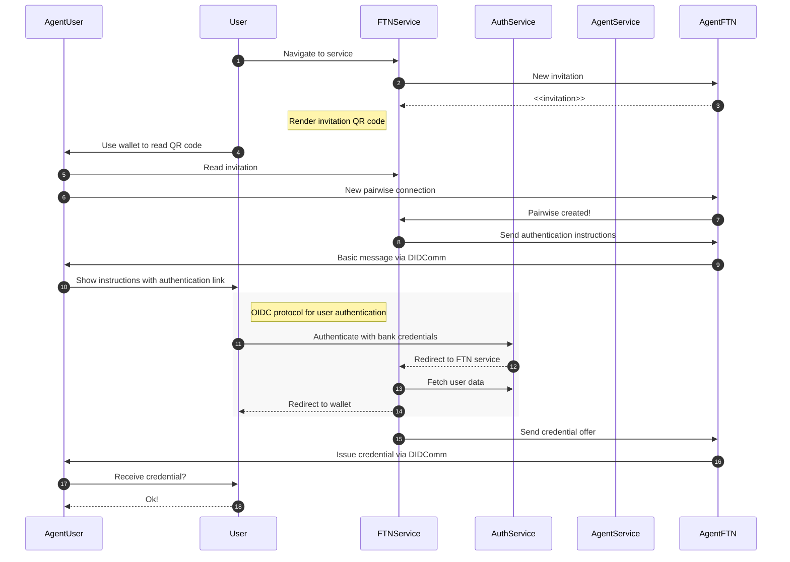

# Issuer tool API

Simple service agent sample for Findy agency

## GitHub authentication

1. [Register GitHub OAuth app](https://github.com/settings/applications/new) to gain Github client ID and secret. Enter following details:

   - Application name: any name e.g. `findy-issuer-app`
   - Application URL: any url e.g. `https://github.com/findy-network`
   - Authorization callback URL: `http://localhost:3001/auth/callback/findy-issuer-app`

   Define following environment variables.

   ```
   export ISSUER_TOOL_GITHUB_USERNAME=<your_gh_username>
   export ISSUER_TOOL_GITHUB_CLIENT_ID=<client_id_from_gh_app>
   export ISSUER_TOOL_GITHUB_CLIENT_SECRET=<client_secret_from_gh_app>
   ```

## FTN credential flow


